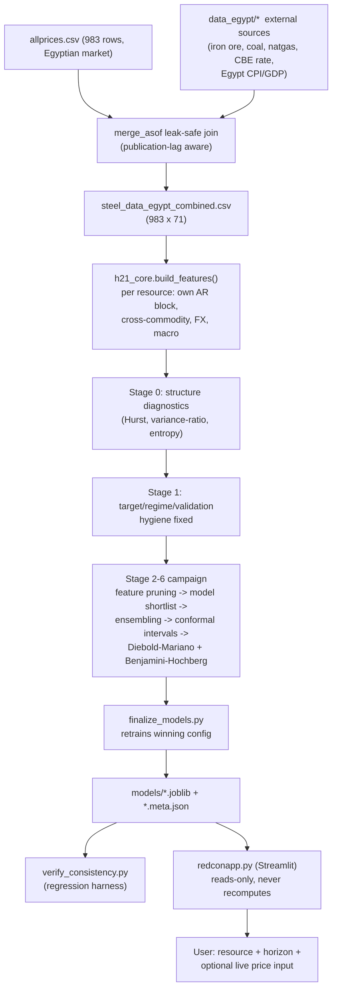

# RedCon — Multi-Resource Construction Material Price Forecasting

Leakage-audited, statistically validated price forecasting for Egypt's construction-materials market — steel, cement, oil, aluminium, and copper — served through an interactive Streamlit app.

## Overview

RedCon forecasts short-horizon prices (1, 3, 7, 14, and 21 observations ahead) for five commodities relevant to construction cost planning in Egypt. Its defining feature is that **every claimed result has to survive a statistical gauntlet before it reaches the app**: a causality check that scrambles future data and demands the past stay bit-identical, walk-forward cross-validation, a Diebold-Mariano test against the naive (persistence) forecast, and Benjamini-Hochberg correction across every configuration tested. Two of the five commodities (steel, cement) are treated as hypothesized "signal" cases; the other three (oil, aluminium, copper) are deliberately kept as **controls** where the project's own prior is that the naive forecast should win — and says so in the UI when it does.

A single shared module (`h21_core.py`) implements feature engineering, splitting, and metrics for both the training pipeline and the Streamlit app, so the numbers shown in the UI are read from frozen training artifacts, never recomputed on the fly.

## Key Features

- **5 commodities × 5 horizons** — steel, cement, oil, aluminium, copper; forecasts at h = 1, 3, 7, 14, 21 observations
- **Leakage-safe by construction and by test** — `assert_causal()` poisons all future rows and asserts every historical feature value is unchanged; a static source scan additionally forbids `bfill`, `backfill`, `center=True`, and negative shifts outside the target function
- **Publication-lag-aware external data** — FRED/IMF commodity prices, World Bank CPI/GDP, and CBE policy rate are merged with `merge_asof` against each source's real publication date, not its nominal period
- **6-stage model campaign** — structure diagnostics → target/regime fundamentals → feature pruning → model shortlist (Ridge/ElasticNet/RF/ExtraTrees/XGBoost/LightGBM/CatBoost/GRU/BiGRU) → ensembling & conformal intervals → Diebold-Mariano + Benjamini-Hochberg significance
- **Train/serve consistency, enforced** — `verify_consistency.py` re-runs the leakage checks and diffs the app's numbers against `leaderboard.csv`
- **Honest UI** — models that don't beat the naive baseline are still shown, with a visible "does not beat naive" indicator, rather than being silently hidden or promoted

## Architecture



## Project Structure

```
Construction-Material-Price-Forecasting/
├── h21_core.py              # Shared feature engineering, splits, metrics, causality asserts
├── stage0_diagnostics.py    # Stage 0: is there exploitable structure at all?
├── stage1_fundamentals.py   # Stage 1: target definition, regime, validation hygiene
├── stage_campaign.py        # Stage 2-6: pruning -> shortlist -> ensemble -> conformal -> DM/BH
├── train_all.py              # Per-resource/horizon training entrypoint (incl. GRU/BiGRU)
├── train_families.py         # Per-family (tabular/deep) training helper
├── finalize_models.py        # Retrains the campaign's winning config; freezes app artifacts
├── verify_consistency.py     # Regression harness: leakage re-check + artifact/app consistency
├── diagnose_charts.py         # Diagnostic tool for chart lag/spike artifacts
├── redconapp.py               # Streamlit app ("RedCon")
├── test_app_paths.py          # App-path smoke test (mocks Streamlit)
├── allprices.csv               # Base price series (Egyptian market)
├── data_egypt/                 # External macro/commodity series
├── steel_data_egypt_combined.csv  # Leak-safe merged dataset (983 x 71)
├── EGYPT_DATA_MERGE_SUMMARY.md # Data provenance & leakage-safety writeup
├── models/                     # Trained artifacts (.joblib + .meta.json) per resource/horizon/family
├── leaderboard.csv, stage*_results.csv, stage6_final.csv  # Run outputs
└── artifacts/, artifacts_egypt/   # Legacy single-resource (steel-only) prototype artifacts
```

## Technology Stack

```text
Python
├── Data / features: pandas, numpy, scipy
├── Classical ML:    scikit-learn (Ridge, ElasticNet, RandomForest, ExtraTrees)
├── Gradient boosting: xgboost, lightgbm, catboost
├── Deep learning:   torch (GRU / BiGRU / attention)
├── Tuning:          optuna
├── Serving / UI:    streamlit, plotly
└── Persistence:     joblib
```
> Recommended command — verify before execution: no `requirements.txt` currently ships with this repository; install the packages above (see [Limitations](#limitations)).

## Dataset

- **Base series** — `allprices.csv`: 983 rows, 2023-01-11 → 2026-08-03, Egyptian market, irregular sampling (median gap 1 day, up to 39 days). Columns include `Steel_Price`, `Cement_Price`, `Oil_Price`, `Aluminium_Price`, `Copper_Price`, and USD buy/sell rates.
- **External sources**, joined via `merge_asof(direction='backward')` against each series' real publication date:
  - FRED/IMF: global iron ore, Australian thermal coal, Henry Hub natural gas (monthly, +35-day publication lag)
  - World Bank: Egypt CPI inflation, GDP growth (annual, treated as available ~6 months after year-end)
  - CBE key policy rate (irregular step series, 0-day lag — publicly announced same day)
- **Merged dataset** — `steel_data_egypt_combined.csv`: 983 rows × 71 columns. Row-count integrity and no-leakage assertions are verified programmatically (see `EGYPT_DATA_MERGE_SUMMARY.md`).
- **Explicitly excluded, not fabricated** — CAPMAS producer/construction price indices, Egypt industrial production index, EGX stock index, and Egypt HS72 trade volumes were investigated and found not obtainable via any accessible API; no placeholder values were generated for them.

## Machine Learning Pipeline

1. **Stage 0 — structure diagnostics**: naive baseline, autocorrelation/Ljung-Box, Hurst exponent, Lo-MacKinlay variance-ratio test, permutation entropy, and drift-to-noise ratio determine, per resource, whether there is anything to model before any model is trained.
2. **Stage 1 — fundamentals**: target definition (log-return vs. return vs. price vs. volatility-normalized — log-return was chosen), outlier/regime handling (full history vs. recency-weighted vs. truncated), and validation-hygiene assertions (purge/embargo).
3. **Stage 2 — feature groups + pruning**: validation-fold permutation importance narrows the feature set per resource/horizon.
4. **Stage 3 — model shortlist**: Ridge/ElasticNet, RandomForest/ExtraTrees, XGBoost, LightGBM, CatBoost (plus GRU/BiGRU via `train_all.py`/`train_families.py`).
5. **Stage 4 — ensembling**, including shrinkage toward the naive forecast.
6. **Stage 5 — conformal prediction intervals** and a frozen directional operating point (dead-zone).
7. **Stage 6 — Diebold-Mariano test, multi-seed stability, Benjamini-Hochberg correction** across all configurations tested (70 per resource/horizon combination) before a model is marked `accepted`.

`finalize_models.py` retrains only the Stage-6 winner and writes the artifacts the app reads; the test set is touched exactly once, at the end.

## Models

| Family | Type | Used for |
|---|---|---|
| Ridge / ElasticNet | Linear | Baseline-competitive on low-signal (control) resources |
| RandomForest / ExtraTrees | Tree ensemble | Shortlist candidate |
| XGBoost | Gradient boosting | Winning family for steel and aluminium (h=1) |
| LightGBM | Gradient boosting | Winning family for oil, copper (h=21) |
| CatBoost | Gradient boosting | Shortlist candidate |
| GRU / BiGRU / Attention-GRU | Recurrent NN (PyTorch) | Sequence modeling candidate, Optuna-tuned |

## Model Performance

Metrics below are read directly from `leaderboard.csv` and `models/*.meta.json` (single frozen test split, h=1 unless noted). `stage6_final.csv` additionally reports walk-forward, multi-seed, Diebold-Mariano/Benjamini-Hochberg–corrected results, which can diverge from the single-split numbers below — both are retained in the repository rather than reconciled into one number, since they answer different questions ("did it win this one time" vs. "is the edge statistically real").

| Resource | Family (h=1) | Test RMSE | Naive RMSE | Test R² | Directional Acc. | n (directional) | Beats naive (single test) | Significant (walk-forward, BH-corrected) |
|---|---|---|---|---|---|---|---|---|
| Steel | XGBoost (trunc50) | 445.0 EGP/ton | 441.6 | 0.660 | 0.667 | 45 | No | Yes |
| Cement | Ridge (full) | 80.3 EGP/ton | 84.1 | −0.424 | 0.719 | 57 | Yes | Yes |
| Oil | Ridge (full) | 4.64 USD/bbl | 4.62 | 0.860 | 0.458 | — | No | No (control) |
| Aluminium | XGBoost (trunc50) | 53.9 USD/ton | 53.5 | 0.910 | 0.574 | — | No | No (control) |
| Copper | Ridge (full) | 0.107 USD/lb | 0.106 | 0.896 | 0.511 | — | No | No (control) |

> Steel and cement are the project's hypothesized "signal" resources; oil, aluminium, and copper are deliberately-kept controls where the naive forecast is expected to win. High R² on the controls largely reflects persistence, not directional skill — this is the expected, documented outcome, not a modeling failure.

## Installation

> Recommended commands — verify before execution. No `requirements.txt` currently ships with this repository (see [Limitations](#limitations)); the package list below is inferred from the imports actually used in the codebase.

```bash
git clone https://github.com/nouralaa311/Construction-Material-Price-Forecasting.git
cd Construction-Material-Price-Forecasting
python -m venv .venv
source .venv/bin/activate        # Windows: .venv\Scripts\activate
pip install -r requirements.txt
pip install pandas numpy scipy scikit-learn xgboost lightgbm catboost torch optuna streamlit plotly joblib
```

> **Note:** trained model artifacts (`models/`, `artifacts/`, `artifacts_egypt/`) are intentionally excluded from version control via `.gitignore` — they are large binaries meant to be regenerated locally, not shipped in the repository. After cloning, you must run the training pipeline below (specifically `finalize_models.py`) before `redconapp.py` has anything to serve.

## Usage

```bash
# Regenerate the merged, leak-safety-checked dataset and diagnostics (optional — already committed)
python stage0_diagnostics.py
python stage1_fundamentals.py

# Run the full 6-stage model campaign
python stage_campaign.py --stage all

# Retrain and freeze the winning configuration per resource/horizon
# (required — this is what populates models/, which the app reads)
python finalize_models.py

# Verify training artifacts and the app agree (leakage + consistency checks)
python verify_consistency.py

# Launch the dashboard
python -m streamlit run redconapp.py
```

## Dashboard / UI

RedCon is a single-page Streamlit app:
- **Sidebar**: pick a resource (auto-discovered from `models/`), a forecast horizon, and a model family (only families actually trained for that resource/horizon are offered).
- **Live price input**: optionally enter today's price for the selected resource; the app rebuilds all lag/rolling/derived features causally from (real history + your value) and reruns external-driver joins using the same publication-lag rules — inference only, nothing is retrained or written to disk.
- **Two clearly separated number types**: "Historical walk-forward performance" (frozen, from training artifacts) vs. "Live forecast from your input" (computed now) are never mixed in the same chart or card.
- Models that were not trained for a given family/horizon combination fall back explicitly, with a visible warning naming the substitution — never silently.

## Results

See [Model Performance](#model-performance) above. Full per-configuration results (all 70 configurations tested per resource/horizon, before pruning to the winner) are in `stage2_results.csv` through `stage6_final.csv`, and the training-time diagnostic-stage outputs are in `stage0_diagnostics.csv` and `stage1_results.csv`.

## Limitations

- **No dependency manifest** — the environment used to build this project is not currently pinned or reproducible from the repository alone.
- **Trained artifacts are not shipped in the repository** — `models/`, `artifacts/`, and `artifacts_egypt/` are excluded via `.gitignore` (they were previously committed directly, adding ~119MB to the repo; this has since been cleaned up going forward). Anyone cloning the repository must run `finalize_models.py` locally before `redconapp.py` has models to serve — there is currently no release/CI step that publishes ready-to-use artifacts separately.
- **Legacy artifacts** — `artifacts/` and `artifacts_egypt/` are outputs of an earlier, steel-only single-resource prototype and are superseded by `models/`; they are not currently marked as legacy in the repository.
- **Small directional test samples** — directional-accuracy figures on the frozen test split are computed on samples in the tens-to-hundreds range per resource/horizon; treat single-split point estimates with caution and prefer the walk-forward, multi-seed numbers in `stage6_final.csv`.
- **Controls are controls** — oil, aluminium, and copper forecasts are not expected to beat the naive baseline by design; high R² on these should not be read as forecasting skill.
- **No license file** — reuse terms are currently unspecified.

## Future Improvements

**Short term**
- Add a `LICENSE` file.
- Mark or remove the legacy `artifacts/`/`artifacts_egypt/` directories.

**Medium term**
- Wire `verify_consistency.py` and `test_app_paths.py` into CI so regressions are caught automatically.
- Publish trained-model binaries via GitHub Releases or Git LFS so users don't have to retrain locally just to run the app.
- Document, in one place, how `leaderboard.csv`'s single-split verdicts relate to `stage6_final.csv`'s walk-forward/BH-corrected verdicts.
- Purge the large binaries from git history (`git filter-repo`/BFG) now that they're untracked going forward, so clone size actually shrinks.

**Advanced**
- Automated retraining pipeline as new price data lands.
- Model monitoring / drift detection on live forecasts vs. realized prices.
- Containerized deployment (Docker) for the Streamlit app.


